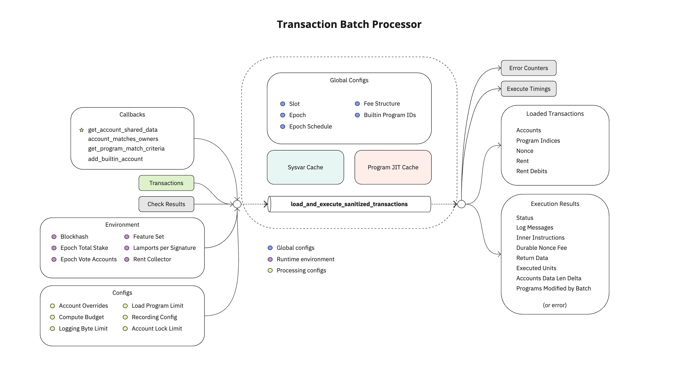

# Benchmarking & PayTube

This repository contains benchmarking experiments for the PayTube state channel implementation. The main goal is to explore and compare different optimization strategies using the Criterion benchmarking framework.

## Modifications from Original PayTube

The original PayTube code has been modified to compare two different approaches for SVM transaction creation:
1. A simple, straightforward implementation (`create_svm_transactions_original`)
2. An optimized version using memory pre-allocation (`create_svm_transactions_preallocated`)

## Benchmarks

The benchmarking suite includes two main comparison scenarios:

### Single Transaction Comparison
Compares the performance of both implementations for processing a single transaction:
- Original vs Pre-allocated for SPL token transfers
- Original vs Pre-allocated for native SOL transfers

### Bulk Transaction Comparison (100 transactions)
Tests the same implementations but with a batch of 100 transactions to better highlight potential performance differences:
- Original vs Pre-allocated for SPL token transfers
- Original vs Pre-allocated for native SOL transfers

## About PayTube

PayTube is a reference implementation of an off-chain [state channel](https://ethereum.org/en/developers/docs/scaling/state-channels/)
built using [Anza's SVM API](https://www.anza.xyz/blog/anzas-new-svm-api).

With the release of Agave 2.0, we've decoupled the SVM API from the rest of the
runtime, which means it can be used outside the validator. This unlocks
SVM-based solutions such as sidecars, channels, rollups, and more. This project
demonstrates everything you need to know about boostrapping with this new API.

PayTube is a state channel (more specifically a payment channel), designed to
allow multiple parties to transact amongst each other in SOL or SPL tokens
off-chain. When the channel is closed, the resulting changes in each user's
balances are posted to the base chain (Solana).

Although this project is for demonstration purposes, a payment channel similar
to PayTube could be created that scales to handle massive bandwidth of
transfers, saving the overhead of posting transactions to the chain for last.

Below is a diagram of the new SVM API.

